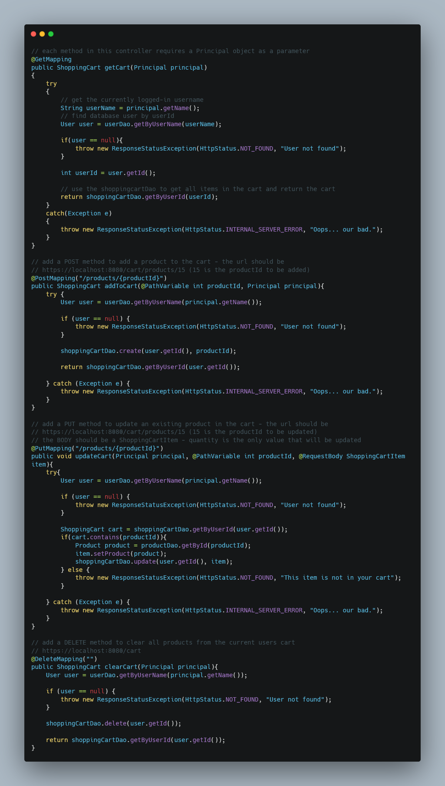
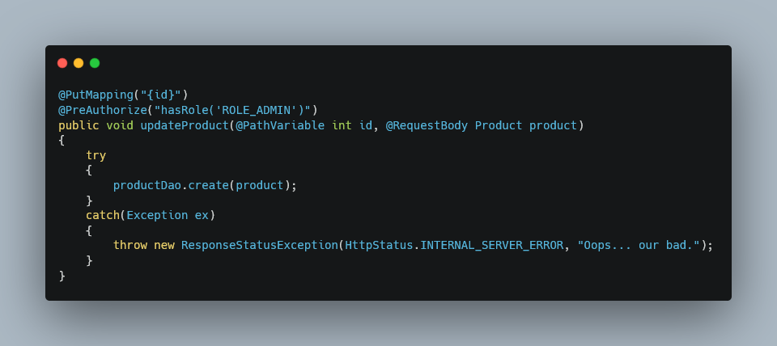
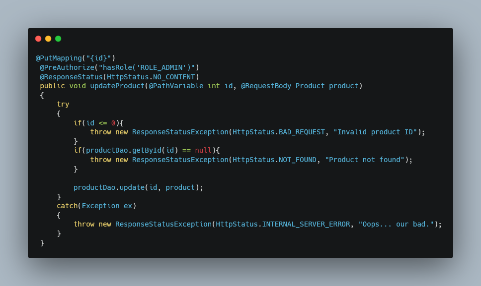

# 🛍️ Nice and EasyShop - E-commerce Platform v2.0

*Because building an e-commerce platform should be nice and easy... right?* 😅

## 📋 Project Overview

**Nice and EasyShop** is a comprehensive e-commerce application built for EasyShop company. This project represents the evolution from version 1 to version 2, featuring significant backend improvements, enhanced security, and new user-centric features.

### 🎯 My Role
**Backend Developer** - Responsible for enhancing the existing operational website, implementing new features, fixing critical bugs, and integrating robust security measures using Spring Boot Security with JWT authentication.

---

## 🚀 Key Features & Achievements

### 🔐 Security Implementation
- **JWT Authentication** - Secure token-based authentication system
- **Spring Boot Security** - Comprehensive authorization and pre-authorization controls
- **Role-based Access Control** - Different permissions for users and administrators

### 🛠️ Core Functionality
- **Enhanced Product Management** - Improved REST API methods with bug fixes
- **Smart Shopping Cart** - Dynamic cart management with quantity controls
- **User Profile Management** - Complete profile viewing and updating capabilities
- **Seamless Checkout Process** - Cart-to-order conversion with automatic cart clearing

---

## 📈 Development Phases

### 🏗️ Phase 1: Foundation Enhancement
**Category REST Method Improvements**
- Refined category management functionality
- Enhanced API response consistency
- Improved error handling mechanisms

### 🔧 Phase 2: Product Management & Security
**Product REST Methods + Bug Fixes**
- Implemented pre-authorization for all product endpoints
- **Fixed**: Product search functionality issues
- **Fixed**: Product duplication bug during admin updates
- Secured admin-only operations

### 🛒 Phase 3: Shopping Cart Implementation
**User Shopping Experience**
- **New Feature**: Complete shopping cart system
- Authentication required for cart access
- Add products to cart functionality
- Quantity management (currently hidden feature)
- Clear cart functionality
- User-specific cart retrieval

### 👤 Phase 4: User Profile Enhancement
**Profile Management System**
- View user profile information
- Update profile functionality
- Seamless profile synchronization
- Secure profile access controls

### 💳 Phase 5: Checkout & Order Processing
**Complete Transaction Flow**
- **New Feature**: Checkout system
- Cart-to-order conversion
- Automatic cart clearing post-checkout
- Order confirmation and tracking

---

## 🛠️ Technology Stack

| Technology | Purpose |
|------------|---------|
| **Spring Boot** | Backend framework |
| **Spring Security** | Authentication & Authorization |
| **JWT** | Token-based authentication |
| **Java** | Primary programming language |
| **REST API** | Service architecture |

---

## 📸 Code Snippets & Screenshots

### 🔐 JWT Authentication Implementation
*Insert screenshot of JWT configuration code*


<<<<<<< HEAD
>>>>>>> e0543a9 (transferred README file from IntelliJ)
=======
>>>>>>> f525629 (merge README changes)

**Token Processing Method:**
This method extracts user authentication information from JWT tokens and converts it into Spring Security Authentication objects. It parses the token, verifies it with the signing key, extracts user roles/authorities, and creates an Authentication object that enables role-based access control throughout the application.


### 🛒 Shopping Cart Controller
*Insert screenshot of shopping cart REST endpoints*


<<<<<<< HEAD
=======

>>>>>>> e0543a9 (transferred README file from IntelliJ)
=======
>>>>>>> f525629 (merge README changes)

### 🔧 Bug Fix: Product Search
*Insert before/after code comparison*

**Before (Buggy Implementation):**


**After (Fixed Implementation):**


=======


**After (Fixed Implementation):**

<<<<<<< HEAD
>>>>>>> e0543a9 (transferred README file from IntelliJ)
=======
>>>>>>> f525629 (merge README changes)

---

## 📹 Feature Demonstrations

### 🎥 Shopping Cart Functionality

[shoppingCartFunctionality.mp4](capstone-starter/src/images/shoppingCartFunctionality.mp4)

### 🎥 User Profile Management
[userProfileFunctionality.mp4](capstone-starter/src/images/userProfileFunctionality.mp4)

=======

### 🎥 User Profile Management
<<<<<<< HEAD
[userProfileFunctionality.mp4](src/images/userProfileFunctionality.mp4)*Insert screenshots of profile view/edit functionality*
>>>>>>> e0543a9 (transferred README file from IntelliJ)
=======
[userProfileFunctionality.mp4](src/images/userProfileFunctionality.mp4)

>>>>>>> f525629 (merge README changes)

---

## 🧪 Testing & Quality Assurance

- **JWT Token Testing** - Comprehensive authentication flow validation
- **Feature Testing** - Each phase thoroughly tested before progression
- **Bug Regression Testing** - Ensured fixes didn't introduce new issues
- **Authorization Testing** - Verified proper access controls across all endpoints

---

## 🎯 Learning Outcomes

### 🆕 First-Time Implementations
- **Spring Boot Security** - First project utilizing this framework
- **JWT Authentication** - Hands-on experience with token-based auth
- **Pre-authorization Annotations** - Learned method-level security

### 🐛 Problem-Solving Skills
- Debugged complex product search algorithms
- Resolved data duplication issues in update operations
- Implemented efficient cart-to-order conversion logic

---

## 🚀 Future Enhancements

- **Advanced Search Filters** - Enhanced product discovery
- **Email Notifications** - Order confirmations and updates
- **Analytics Dashboard** - Admin insights and reporting
- **UI/UX Improvements** - Frontend modernization
- **Inventory Management** - Stock tracking and alerts

---

## 📝 Installation & Setup

### Prerequisites
- Java 11 or higher
- Maven 3.6+
- Database (MySQL/PostgreSQL)

### Quick Start
```bash
# Clone the repository
git clone https://github.com/yourusername/nice_and_easyShop.git

# Navigate to project directory
cd nice_and_easyShop

# Install dependencies
mvn clean install

# Run the application
mvn spring-boot:run
```

---

*Built with ☕ and determination by Damian*

**"What started as 'nice and easy' became a comprehensive learning journey in backend development!"** 🎓
<<<<<<< HEAD
=======
**"What started as 'nice and easy' became a comprehensive learning journey in backend development!"** 🎓
>>>>>>> e0543a9 (transferred README file from IntelliJ)
=======

>>>>>>> f525629 (merge README changes)
